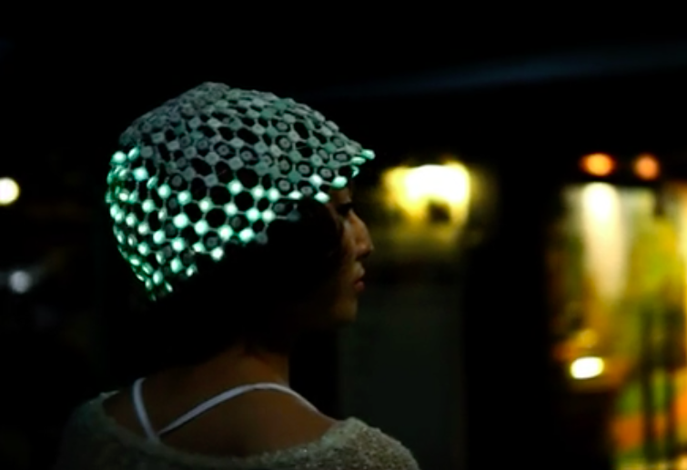
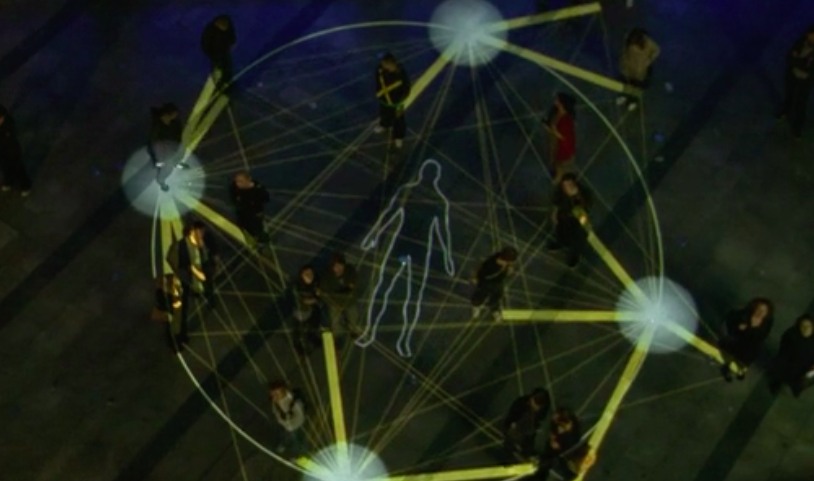
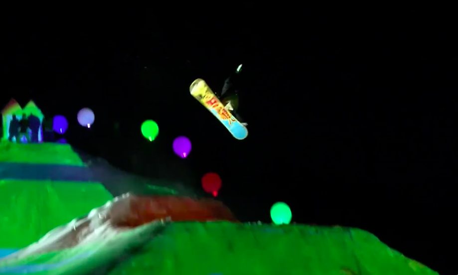
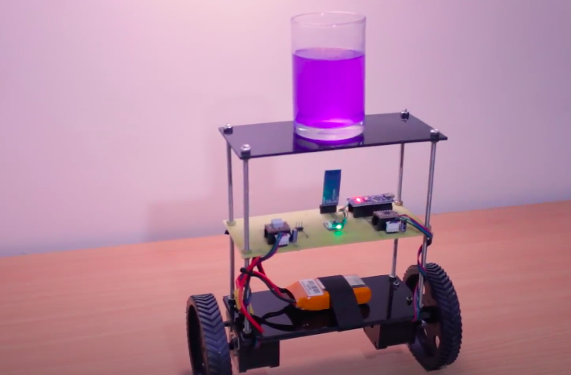

# 1701QCA Making Interaction - Assessment 2 workbook

You will use this workbook to keep track of your progress through the course and also as a process journal to document the making of your projects. The comments in italics throughout the template give suggestions about what to include. Feel free to delete those instructions when you have completed the sections.

When you have completed the template, submit the link to the GitHub Pages site for this repository as a link in Learning@Griffith. The link should be something like [https://qcainteractivemedia.github.io/1701QCA-Assessment2/](https://qcainteractivemedia.github.io/1701QCA-Assessment2/) where `qcainteractivemedia` is replaced with your GitHub username and `1701QCA-Assessment2` is replaced with whatever you called the repository this template is contained in when you set it up.

## Project working title ##
*Interactive lighting.*

## Related projects ##
*Find about 6 related projects to the project you choose. A project might be related through  function, technology, materials, fabrication, concept, or code. Don't forget to place an image of the related project in the appropriate folder and insert the filename in the appropriate places below. Copy the markdown block of code below for each project you are showing.*

### Related project 1 ###
*Gravity of light*

*https://www.trendhunter.com/trends/led-hat*

This project is related to mine because of the way it uses light and movement to create an interactive item. this hat reacts to differnt movements and wil display a light show according to them.

### Related project 2 ###
*Arduino Accelerometer Data Logger Project*

*https://www.youtube.com/watch?v=7EBpjjKGRJQ*

This project is related to mine because of the use of an accelerometre. using an accelerometre the man craeted a data logger to learn about what happens when a car accelerwates and goes around corners.

### Related project 3 ###
*Great Street Games*

*https://www.trendhunter.com/trends/great-street-games*

This project is related to mine because of its use of movement and coreponding light shows. this project gets a community involved to play games with light.

### Related project 4 ###
*gesture controled robot*

*https://www.youtube.com/watch?v=rejZmqRrKMc*

This project is related to mine because of its use of motion using an accelerometer. using an accelerometer and the directional movemnt of the users had the robot will move according to the controller.

### Related project 5 ###
*Color Mountain*

*https://www.trendhunter.com/trends/color-mountain*

This project is related to mine because through motion of people on a snowboard different lights are being projected onto the snow hills.

### Related project 6 ###
*Arduino Project-Self Balancing Robot*

*https://www.youtube.com/watch?v=I6z26LVu5y0*

This project is related to mine because using the accelerometer it corrects its orrientation to stay up right.

## Conceptual progress ##

### Design intent ###
Create a interactive device that displays lights/Information depending on movement

### Design concept 1 ###
a cube with multiple faces and functions. for example, one side displays time, one temperature, one weather. using the accelerometre it can detect what side its facing and display the correspodning information. 

### Design concept 2 ###
a mood tracker. a small device with a series of steps it can be placed on. depending on your mood each day you can put the device higher or lower and it will display a color depending on what mood step youve put it on. could be a good way to tell people how your feeling without saying it.

### Final design concept ###
an object that sits niceley on a bedside table that is flipped to different sides to create different light show. examples like a a fast stobe to pair with some music for a bedroom party. a slow transitioning color wheel for if you need something mellow to fill the room. single color projection to fill a room with a certain color. a regular light to make a room brighter. im inspired by natural rocks with strange yet practicle standing shapes. some examples.

### Interaction flowchart ###
*Draw a draft flowchart of what you anticipate the interaction process in your project to be. Make sure you think about all the stages of interaction step-by-step. Also make sure that you consider actions a user might take that aren't what you intend in an ideal use case. Insert an image of it below. It might just be a photo of a hand-drawn sketch, not a carefully drawn digital diagram. It just needs to be legible.*

## Physical experimentation documentation ##

*In this section, show your progress including whichever of the following are appropriate for your project at this point.
a.	Technical development. Could be code screenshots, pictures of electronics and hardware testing, video of tests. 
b.	Fabrication. Physical models, rough prototypes, sketches, diagrams of form, material considerations, mood boards, etc.
Ensure you include comments about the choices you've made along the way.*

*You will probably have a range of images and screenshots. Any test videos should be uploaded to YouTube or other publicly accessible site and a link provided here.*

## Design process discussion ##
*Discuss your process in getting to this point, particularly with reference to aspects of the Double Diamond design methodology or other relevant design process.*

## Next steps ##
*Write a list or provide other information about your plan to move the project forward to be ready to present by video and documentation in week 12 of the course.*
